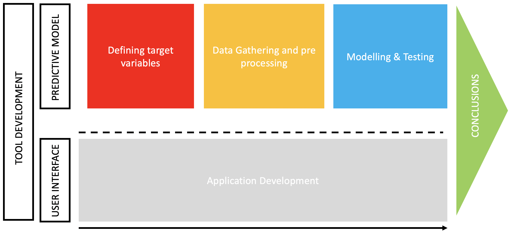
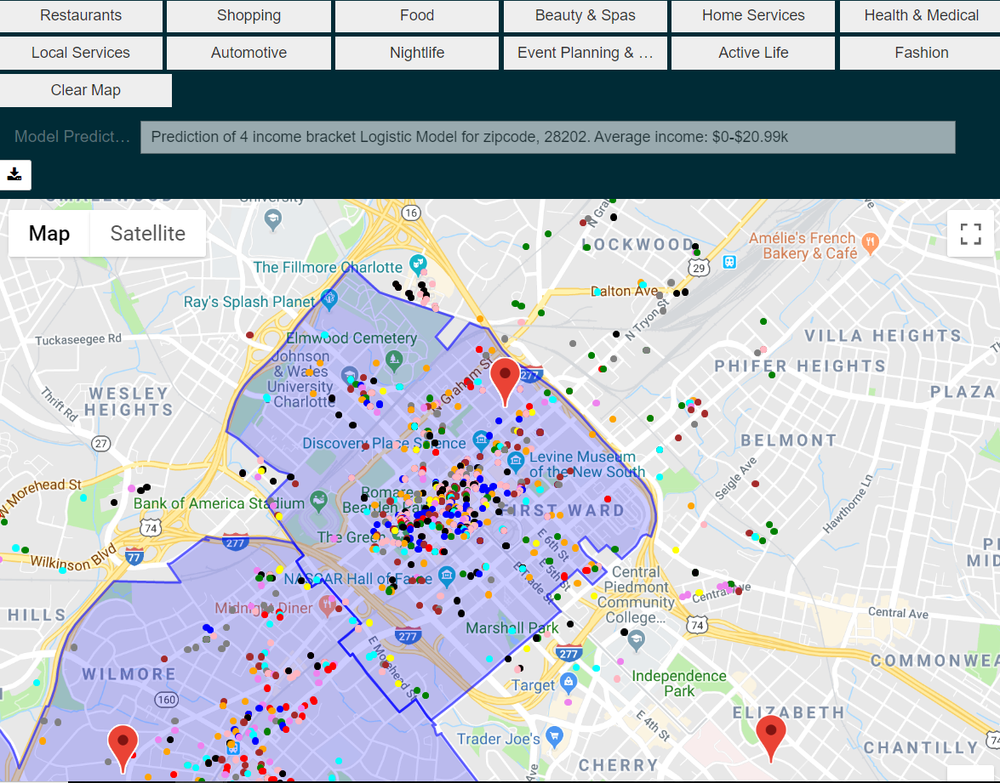

# Utilizing Yelp Businesses Categories and price ranges to predict neighborhoods affluency

#### Authors: Jacopo Cecchi, Jason Leung

### Overview

1. [Context](#Context)
2. [Objectives and Methodology](#Objectives-and-Methodology)
3. [Executive Summary](#Executive-Summary)
4. [Repository Structure](#Repository-Structure)
5. [Interactive Googlemaps Tool](#Interactive-Googlemaps-Tool)
6. [Project Workflow](#Project-Workflow)

  

### Context

As part of the [curriculum](https://generalassemb.ly/education/data-science-immersive) of the 12-weeks Immersive Program in Data Science at [General Assembly](https://generalassemb.ly/why-ga-is-worth-it), students have the opportunity of working on real world problems with real world data. [New Light Technologies](https://newlighttechnologies.com/) - more about the company [here](https://newlighttechnologies.com/) - asked program participants to do pro bono work on the following project, whose findings can be potentially utilized to assess the economic impact of emergencies on urban areas. Candidates Jason Leung and Jacopo Cecchi worked on the project over a period of 2 weeks. The project prompt: "develop a tool that takes, as an input, a list of zip codes... and will estimate the wealth of the locality. While traditional methods typically estimate wealth of a locality based on demographic characteristics (e.g. income or unemployment rate), the novelty of this approach is in its use of big data related to commercial activity and cost of product and services as an indicator for affluency."

  

### Objectives and Methodology

Within the scope of this work we develop a tool to estimate neighborhood affluency leveraging Yelp prices estimates and business categories information from Yelp.

Our goal is twofold: 

1. Develop a model to predict average income per capita in a given neighborhood leveraging Yelp local business data, each businesses general price range and business categories.
2. Develop a visualization tool that will deploy this model and let the user select any area in the US, view all businesses in the area and receive the income prediction given those businesses, all in real-time. 

  

### Executive Summary

- A working Googlemaps tool that allows users to retrieve affluency estimates for a given area given Yelp’s businesses and services costs estimates has been developed.
- Several supervised learning models – Logistic Regression, KNN, CART, Random Forest, Bagging Classifier, Adaboost and SVC have been trained and tested on a total count of 7 US cities. Among these, KNN resulted to be the best performing model.
- While models perform well – F1 score of ca. 90% on test sets of cities on which they are trained, their performance is inaccurate on testing sets of cities on which they have not been trained. We believe that this outcome is partially due to the fact that algorithms manage to identify geographic patterns in the data even if they are not fed businesses geographic coordinates directly.
- Our tool is relatively reliable at estimating a city’s neighbors affluency, BUT only when it has been trained on a set of observations of that specific city. Without a city-specific training, the model is not good at serving its purpose as it is accurate ca. less than 20% of the time.
- This study shows possibilities in predicting per capita income of a locality based just on Yelp estimates of surrounding businesses and services activities and prices.
- Further research could explore if models trained on a wide range of US cities would give better baseline predictions of affluency in non-training US cities.

For a more in depth overview of the project please refer to our presentation slides, which summarize our project, objectives, methodology and results. The slide pdf can be found [here](./Project_4_JLJC_01_18_19.pdf).

  

### Repository Structure

This repository contains all jupyter notebooks used in this project, named with a number prefix that indicates project stage. It also contains all [raw data files for the 7 US cities examined](https://github.com/jaswll/Yelp_Businesses_Project_Final/tree/master/City_Raw_Data_Files). Representative data files for each stage of our data processing can be referred to in the  [1st cities](https://github.com/jaswll/Yelp_Businesses_Project_Final/tree/master/1st_citiesFinalsets) and [2nd cities](https://github.com/jaswll/Yelp_Businesses_Project_Final/tree/master/2nd_citiesFinalsets) datasets. The [final cities datasets folder](https://github.com/jaswll/Yelp_Businesses_Project_Final/tree/master/Final_Cities_Datasets) contains the most updated datasets including 2019 data scraped from Yelp. Trained predictive models used for our final results in the Models and Results folder include logistic classifiers and random forest classifiers for a range of bracketing of incomes.

The important notebooks will be summarized in the project workflow section below but for testing please refer to the [10_GoogleMaps_UserSearch.ipynb](https://github.com/jaswll/Yelp_Businesses_Project_Final/blob/master/10_GoogleMaps_UserSearch.ipynb) and [11_GoogleMaps_App.ipynb](https://github.com/jaswll/Yelp_Businesses_Project_Final/blob/master/11_GoogleMaps_App.ipynb). In notebook 10 and in [Xmatrix_Pipeline_Functions.ipynb](https://github.com/jaswll/Yelp_Businesses_Project_Final/blob/master/Xmatrix_Pipeline_Functions.ipynb), tracing the sequence of functions the Googlemaps tool calls shows every stage of the project. Before running any notebook, all modules not previously installed from [imports_and_functions.ipynb](https://github.com/jaswll/Yelp_Businesses_Project_Final/blob/master/imports_and_functions.ipynb), must be added. The non-standard python modules are: gmaps (from jupyter-gmaps), geopy, uszipcode, and geojson. In order to run the Googlemaps tool, all files in the main directory should downloaded and the US state zipcode boundary files in folder zipcodes_geojson should be first unzipped. Lastly, to run the tool a Googlemaps API key is required, which is available to the public for free from google by request https://developers.google.com/maps/documentation/javascript/get-api-key, or by email from Jason Leung.

  

### Interactive Googlemaps Tool

Our project tool takes advantage of the python module jupyter-gmaps to embed a fully functional Googlemaps interface inside the notebook. This tool allows one to specify any 1000 meter search radius in the US, and then display businesses and predict affluency for the selected search area. It will display all businesses within that area, color coded by the main category of the business.

The 12 buttons at the top of the interface allow the user to select or de-select the display of each main business category. A Googlemaps marker (light red shape) indicates the center of the search radius and the text box right above the map shows the progress of the model in its processing and prediction of that specific coordinates' average income. After processing, the text box updates with the predicted income bracket of that location, and a new search can be performed. The map saves and displays the zip code boundaries - in light blue - and businesses - colored by macro category - of the two most recent searches.

  

### Project Workflow

This Yelp businesses project required intensive data cleaning and engineering in order to achieve the training datasets fed into each machine learning model. First, the Yelp provided Kaggle dataset was used, available here: https://www.kaggle.com/yelp-dataset/yelp-dataset. Notebooks [01_EngineerRows_andLasVegas.ipynb](https://github.com/jaswll/Yelp_Businesses_Project_Final/blob/master/01_EngineerRows_andLasVegas.ipynb), [03_VectorizeBusinesses_LasVegasTrainset_Model.ipynb](https://github.com/jaswll/Yelp_Businesses_Project_Final/blob/master/03_VectorizeBusinesses_LasVegasTrainset_Model.ipynb) through [04-4_LasVegas_Pipeline_toXtrain_(Readme_Code)](https://github.com/jaswll/Yelp_Businesses_Project_Final/blob/master/04-4_LasVegas_Pipeline_toXtrain_(Readme_Code).ipynb) process these raw latitude/longitude and category business information as well as raw US Census data files for income and population. [02_Yelp_GetBusinessList.ipynb](https://github.com/jaswll/Yelp_Businesses_Project_Final/blob/master/02_Yelp_GetBusinessList.ipynb) contains all code to extract up to date Yelp city data, (for yelp api key please email Jason Leung). The 1st set of cities processed and analyzed can be walked through in notebooks 04-1 through 04-4; this set includes: Las Vegas, Phoenix, Charlotte and Pittsburgh, which are the cities with the highest business count in the Kaggle datase. Please refer to the [pdf presentation](https://github.com/jaswll/Yelp_Businesses_Project_Final/blob/master/Project_4_JLJC_01_18_19.pdf) for more information and for representative Las Vegas population and business density maps.

There are clear areas and clustering where businesses should have good predictive power towards neighborhood affluency, though other factors such as property values might be even more important. Our models are not given any geographic location information other than  distance from the search radius center. But, they are able to pick out some of the affluency patterns and clustering using business data. [05_LasVegas_Modeling_PCA.ipynb](https://github.com/jaswll/Yelp_Businesses_Project_Final/blob/master/05_LasVegas_Modeling_PCA.ipynb) shows initial models focused only on Las Vegas which have quite good accuracy scores predicting income brackets. Even when training over multiple cities - [06_LasvegasPhoenixCharlottePittsburgh_Modeling.ipynb](https://github.com/jaswll/Yelp_Businesses_Project_Final/blob/master/06_LasvegasPhoenixCharlottePittsburgh_Modeling.ipynb) - and testing over a random subset across four cities, accuracy scores decreased and show overfitting (training scores 10%+ higher than test set) but test scores in the 80% accuracy were achieved.

On the other hand, all modeling afterwards (with testing on new US cities or cities without providing any training data on the city beforehand) show accuracy scores lower than 40% ([08-1_BostonMiamiSeattle_Modeling.ipynb](https://github.com/jaswll/Yelp_Businesses_Project_Final/blob/master/08-1_BostonMiamiSeattle_Modeling.ipynb)). Updated 2019 business data for our original cities were obtained to match the 2nd round cities in [07-1_Boston_Pipeline_toXtrain.ipynb](https://github.com/jaswll/Yelp_Businesses_Project_Final/blob/master/07-1_Boston_Pipeline_toXtrain.ipynb) through [07-3](https://github.com/jaswll/Yelp_Businesses_Project_Final/blob/master/07-3_Seattle_Pipeline_toXtrain.ipynb), but scores remained virtually identical. The 2019 datasets for the 1st four cities were actually different. There was much more category labeling overall, meaning frequency counts for many categories were 5 times as high as the 2014 data ([08-2_1stCities_2019data_Modeling.ipynb](https://github.com/jaswll/Yelp_Businesses_Project_Final/blob/master/08-2_1stCities_2019data_Modeling.ipynb)). Unfortunately, the core thesis remained: to predict affluency well for a city, one needed some business and affluency data to train with, in order to set some sort of baseline for all model types.

The interactive Googlemaps tool integrates all of the primary functionality of notebooks 01 through 09. It queries and extracts from all business Yelp data from locations within 1000 meters of the user given search point. With this raw data, it cleans, processes and engineers all dataset columns. The current iteration of the tool is run exclusively in jupyter notebook. The [11_GoogleMaps_App.ipynb](https://github.com/jaswll/Yelp_Businesses_Project_Final/blob/master/11_GoogleMaps_App.ipynb) notebook provides a minimized interface for the testing of the tool. 